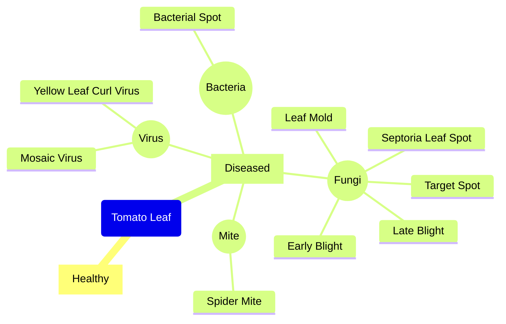
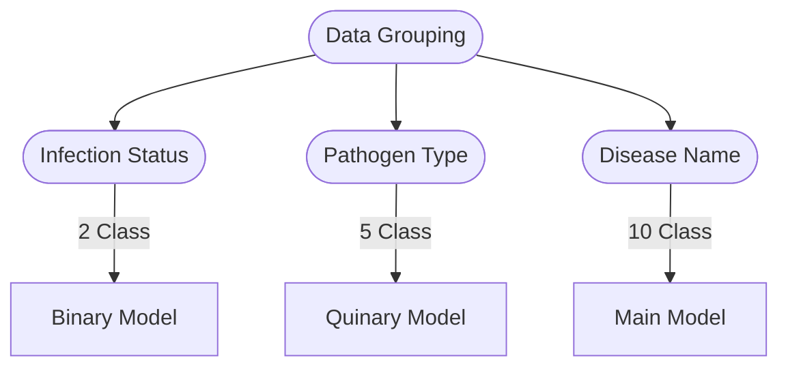
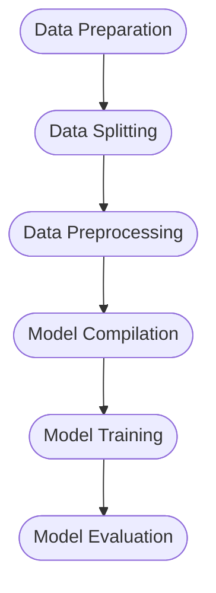
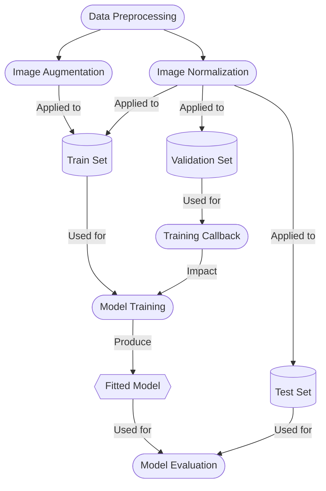

# Project Diagram
## Mind Map: Tomato Leaf Disease

```mermaid
mindmap
root(Tomato Leaf)
    [Healthy]
    [Diseased]
        ((Bacteria))
            Bacterial Spot
        ((Fungi))
            Early Blight
            Late Blight
            Leaf Mold
            Septoria Leaf Spot
            Target Spot
        ((Mite))
            Spider Mite
        ((Virus))
            Yellow Leaf Curl Virus
            Mosaic Virus
```

## Concept Map: Model Type

```mermaid
graph
%% nodes definition

A([Data Grouping])
C1([Infection Status])
C2([Pathogen Type])
C3([Disease Name])

M1[Binary Model]
M2[Quinary Model]
M3[Main Model]

%% nodes use
A --> C1
A --> C2
A --> C3
C1 -- 2 Class --> M1
C2 -- 5 Class --> M2
C3 -- 10 Class --> M3
```

## Concept Map: Workflow

```mermaid
graph
%% nodes definition
P1([Data Preparation])
P2([Data Splitting])
P3([Data Preprocessing])
P4([Model Compilation])
P5([Model Training])
P6([Model Evaluation])

%% nodes use
P1 --> P2
P2 --> P3
P3 --> P4
P4 --> P5
P5 --> P6
```

## Concept Map: Action to Splitted Data

```mermaid
graph
%% nodes definition
D1[(Train Set)]
D2[(Validation Set)]
D3[(Test Set)]

A0([Data Preprocessing])
A1([Image Normalization])
A2([Image Augmentation])

P1([Model Training])
P2([Training Callback])
P3([Model Evaluation])

M0{{Fitted Model}}

%% nodes use
A0 --> A1
A0 --> A2

A2 -- Applied to --> D1
A1 -- Applied to --> D1
A1 -- Applied to --> D2
A1 -- Applied to --> D3

D1 -- Used for --> P1
M0 -- Used for --> P3
D2 -- Used for --> P2
D3 -- Used for --> P3

P2 -- Impact --> P1
P1 -- Produce --> M0
```